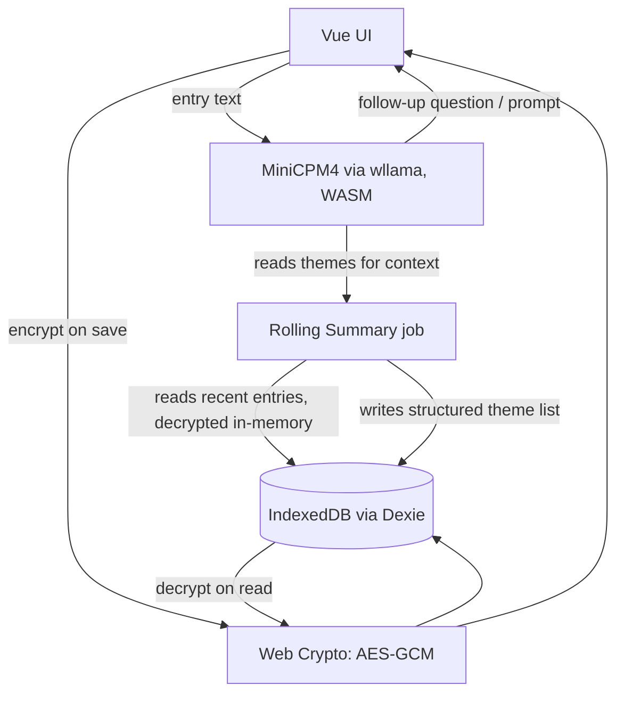

# MindScribe (Reflective Journal PWA) — Architecture

No server component. Everything — inference, storage, encryption — runs on-device in the browser. This doc covers the "how it hangs together" concerns that would normally live in a backend doc: model integration, the local data/encryption layer, and offline/caching strategy. Data schema itself lives in the separate Data Schema doc.

## Stack

- **Framework**: Vue 3 + Vite, `vue-router` (local-first, no-backend precedent; Nuxt's SSR/Nitro conventions don't apply here since there's no server to render or route)
- **Local inference**: MiniCPM4 (text-only line), quantized GGUF, run via wllama (WASM)
- **Local storage**: IndexedDB via Dexie.js
- **Encryption**: Web Crypto API (AES-GCM for data, PBKDF2/Argon2-class KDF for key derivation)
- **Hosting**: static — Cloudflare Pages or similar, no backend runtime needed
- **PWA**: `vite-plugin-pwa` for service worker (offline app shell + model weight caching)

## System overview



Key point: the model never touches disk. Decryption happens in-memory only, for the duration of generating a response or regenerating the summary; nothing unencrypted is ever written to IndexedDB.

## Model integration

- **Why MiniCPM4 specifically**: text-only variant chosen over MiniCPM-o/V since this phase is explicitly text-only — no point shipping vision/audio encoders that add download size and RAM pressure for features that aren't used yet. Phase 2 (voice) may warrant a model swap or moving to the omni line at that point — this is a deliberate tradeoff of phase-1 leanness vs phase-2 continuity, and should be revisited when phase 2 is actually scoped rather than pre-decided now.
- **Where inference runs**: entirely client-side via wllama/WASM. No API calls, no network dependency at generation time.
- **Context budgeting**: the model is never fed the full journal. Per generation, context = current entry text + rolling summary (structured theme list) + at most the last 1-2 raw entries. This keeps inference fast and avoids the "dump everything" pattern that gets slower and less coherent as the journal grows.
- **Rolling summary regeneration**: scheduled (weekly or every N entries — exact cadence TBD, see Open questions), not on every save. Also triggered on entry deletion (regenerate from remaining entries, since there's no clean per-entry-to-theme mapping to do a targeted removal).
- **Model loading/caching**: GGUF weights fetched once on first use, cached by the service worker so subsequent app opens are fully offline. First-run needs a clear "downloading your private AI" UX moment since even quantized weights are a non-trivial download.

## Encryption / key layer

This is the trickiest logic in the app — documenting it explicitly so it's not improvised mid-build.

**Two separate concerns, deliberately decoupled:**

1. **At-rest encryption** (always on, regardless of PIN): every entry is encrypted before being written to IndexedDB.
   - If app-unlock PIN is **enabled**: encryption key is derived from the PIN (KDF)
   - If PIN is **disabled**: a device-generated key is used instead (generated once, stored locally e.g. via a non-extractable Web Crypto key or securely in IndexedDB itself) — encryption still happens, it's just silent/frictionless
2. **Export protection** (separate key, separate decision, made explicit at export time — see Export/Import flow): a device-generated key by definition can't be used for a portable backup, since it never meaningfully "exists" outside that device. So export always asks, at export time: "Protect this backup with a PIN?" — independent of whatever the at-rest encryption mode is.
   - Yes → 6-digit PIN → KDF-derived key → encrypts the export bundle → file flagged `protected: true`
   - No → plain export → file flagged `protected: false`, clearly labeled as unprotected in the UI at export time
   - Import reads the flag and prompts for PIN only if needed

**Why not one static key for exports**: a value baked into shipped app code (JS bundle/WASM) is the same across every install — one extraction, posted anywhere, breaks it for all users permanently. Rejected explicitly during scoping; see PRD for the reasoning. Every export's protection (when enabled) is keyed to something only that user provided at that moment.

## Service worker / offline strategy

- Cache app shell (HTML/CSS/JS) — standard PWA precache
- Cache model weights (GGUF file) separately — large, versioned, only re-fetched on model update, not on every deploy
- IndexedDB itself needs no special offline handling (it's inherently local) — the service worker's job here is purely making sure the *app and model* are available offline, not the data

## Folder structure

```
src/
├── views/
│   ├── DashboardView.vue
│   ├── entry/
│   │   └── NewEntryView.vue
│   ├── history/
│   │   ├── HistoryView.vue
│   │   └── EntryDetailView.vue
│   └── settings/
│       ├── SettingsView.vue
│       ├── MemoriesView.vue
│       ├── ExportView.vue
│       └── ImportView.vue
├── router/
│   └── index.ts                   # vue-router route definitions
├── lib/
│   ├── db/
│   │   ├── schema.ts              # Dexie schema
│   │   └── crypto.ts              # encrypt/decrypt, KDF logic
│   ├── model/
│   │   ├── wllama-client.ts       # model load + inference calls
│   │   └── summary.ts             # rolling summary generation/regen logic
│   └── safety/
│       └── crisis-check.ts        # deterministic keyword/pattern check
├── stores/                        # Pinia stores, or plain Vue reactive composables
└── service-worker.ts              # generated/managed via vite-plugin-pwa
```

## Libraries / dependencies

- `dexie` — IndexedDB wrapper
- `@wllama/wllama` — WASM LLM inference (the unscoped `wllama` npm name was removed; this is the official successor package, same author/repo)
- Web Crypto API — native, no dependency needed for AES-GCM/PBKDF2

## Open questions / TODO

- Exact rolling-summary regeneration cadence (weekly vs every N entries)
- Exact KDF choice + iteration count for PIN-derived keys (PBKDF2 vs Argon2id — Argon2id is stronger but needs a WASM implementation since it's not native to Web Crypto; worth checking bundle-size tradeoff)
- Deterministic safety-check keyword/pattern list — needs dedicated research rather than an ad hoc list, given the stakes of getting it wrong
- Confirm actual MiniCPM4 quantized model size and wllama load time on target devices before committing to UX around first-load download