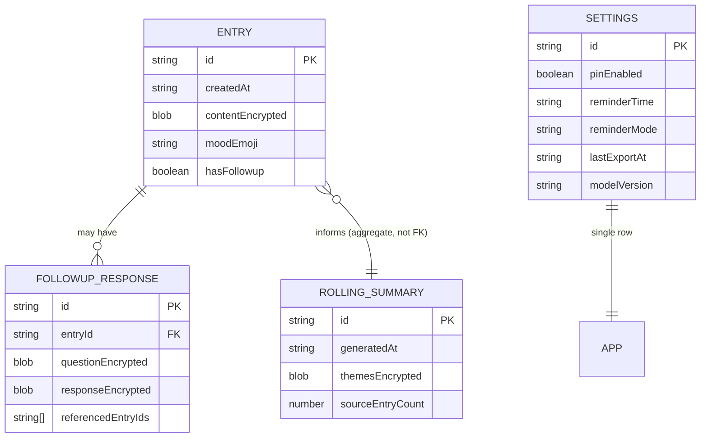

# MindScribe (Reflective Journal PWA) — Data Schema

All data lives in IndexedDB (via Dexie.js), on-device only. No server, no remote schema. Field names are camelCase in the implementation (TS/JS convention) — this doc mirrors the code. Diagram uses `erDiagram` for clarity even though the underlying store is IndexedDB, not SQL.

## Entity relationships

Note: `ROLLING_SUMMARY` is a derived aggregate, not linked to individual entries via foreign key — there's no clean per-entry provenance to track, which is why entry deletion triggers a full regeneration rather than a targeted removal (see Architecture doc).

## Entities

### Entry
| Field | Type | Notes |
|---|---|---|
| id | string (uuid) | PK |
| createdAt | ISO timestamp | plaintext — needed for calendar queries without decrypting every entry (indexed) |
| contentEncrypted | blob | AES-GCM encrypted entry text |
| moodEmoji | string | plaintext — user-selected, used for calendar display; not sensitive enough to require decryption just to render the dashboard |
| hasFollowup | boolean | plaintext — flags whether a FollowupResponse exists, for UI purposes |

### FollowupResponse
| Field | Type | Notes |
|---|---|---|
| id | string (uuid) | PK |
| entryId | string (uuid) | FK → Entry (indexed, for cascade reads/deletes) |
| questionEncrypted | blob | the model's follow-up question, encrypted |
| responseEncrypted | blob | user's response, encrypted, appended context to the entry |
| referencedEntryIds | string[] (uuid) | plaintext — ids of entries the question was grounded in, so the UI can offer a swipe-peek at them before the user answers; ids alone leak nothing |

### RollingSummary
| Field | Type | Notes |
|---|---|---|
| id | string (uuid) | PK — typically only one active row, but versioned for regeneration history if useful |
| generatedAt | ISO timestamp | plaintext |
| themesEncrypted | blob | encrypted structured list: `[{ topic, lastMentionedDaysAgo, mentionCount }]` |
| sourceEntryCount | number | plaintext — how many entries this summary was generated from, useful for debugging/regeneration logic |

### Settings
| Field | Type | Notes |
|---|---|---|
| id | string | PK, single row |
| pinEnabled | boolean | plaintext |
| reminderTime | string (HH:mm) | plaintext, optional |
| reminderMode | enum | `start_of_day` \| `end_of_day` \| `off` |
| lastExportAt | ISO timestamp | plaintext, optional |
| modelVersion | string | tracks which model/quant version is loaded, for future migration handling |

## What's encrypted vs plaintext, and why

- **Encrypted**: entry content, follow-up Q&A, rolling summary theme content — anything that reveals what the user actually wrote or thought about
- **Plaintext**: timestamps, mood emoji, boolean flags, settings values — needed for dashboard rendering (calendar markers, mood display) without a full decrypt pass on every entry just to draw the calendar. None of these leak entry *content* on their own.

## Open questions / TODO

- Whether `mood_emoji` being plaintext is an acceptable tradeoff long-term, or whether a future version should encrypt it too and accept the decrypt cost for calendar rendering — flagged as a deliberate v1 simplification, not a final answer
- Migration strategy if the Entry schema changes after users already have local data (IndexedDB schema versioning via Dexie's built-in versioning should cover this, but not yet designed in detail)
