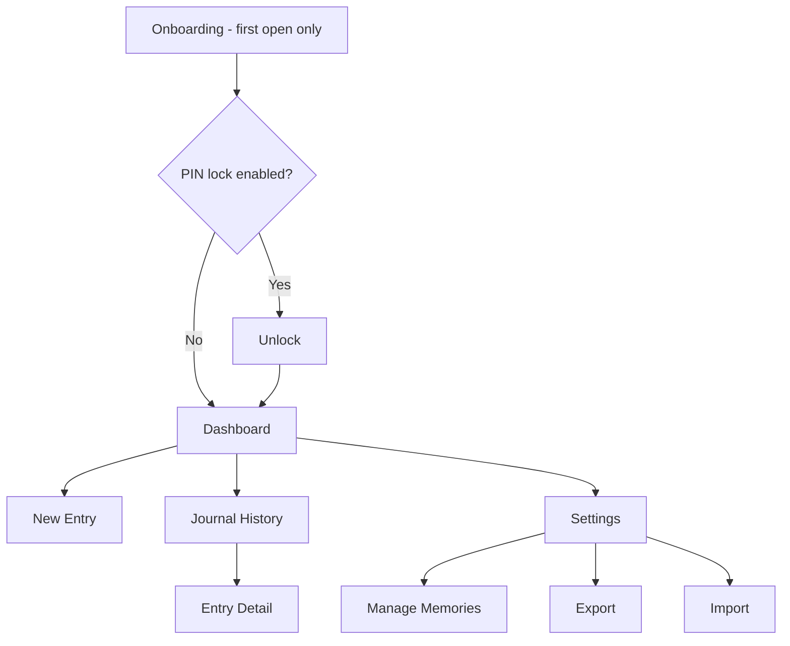
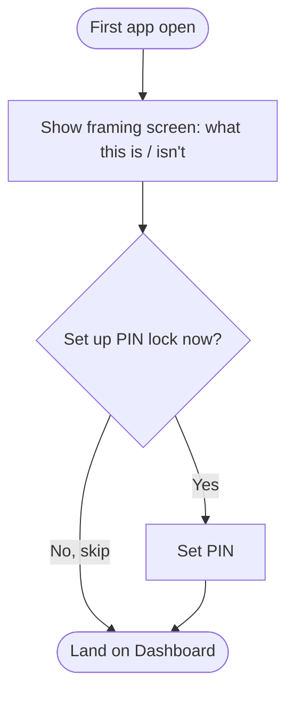
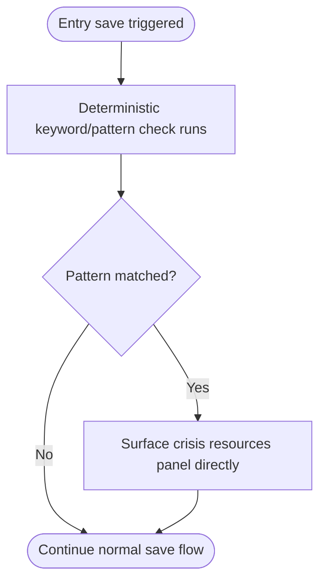
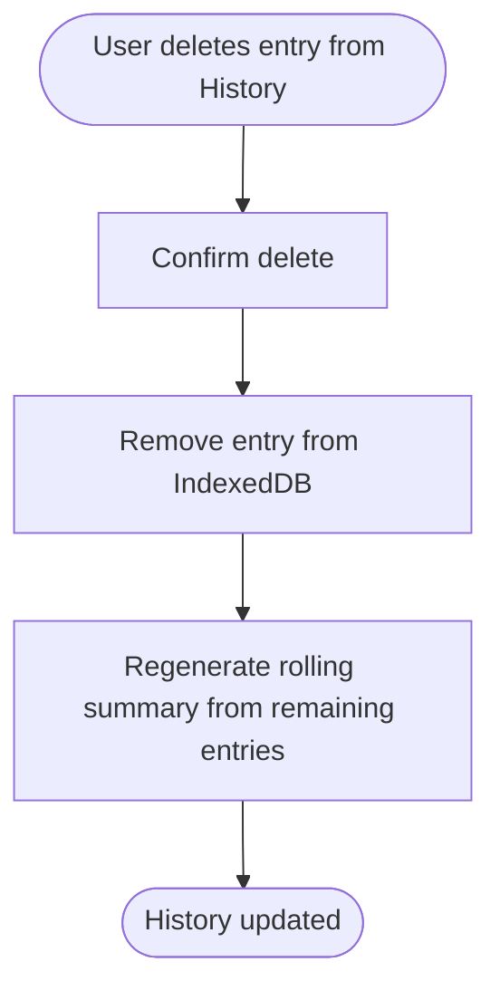
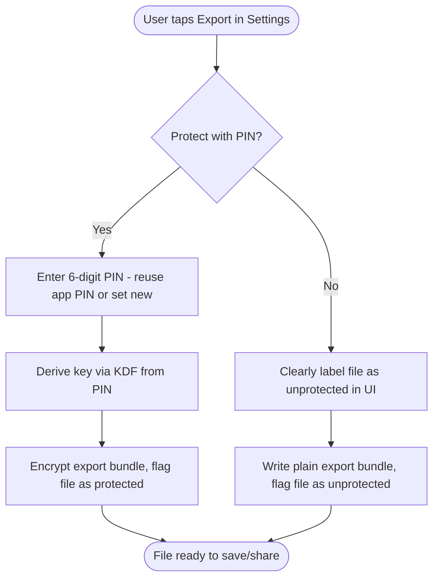
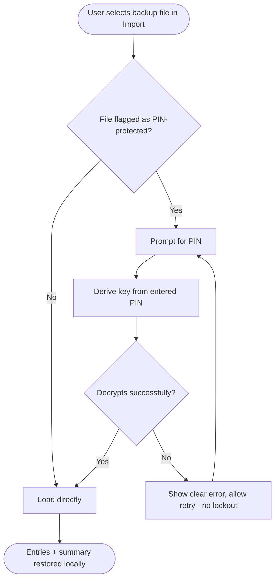

# MindScribe (Reflective Journal PWA) — Flow

## Page list

Single-role app — no role column needed.

| Page | Purpose | Route (proposed) |
|---|---|---|
| Onboarding | One-time framing: what this is / isn't | /onboarding |
| Unlock | PIN entry, if PIN lock is enabled | /unlock |
| Dashboard | Add entry, month calendar, mood markers | / |
| New Entry | Free-write, optional prompt assist, follow-up | /entry/new |
| Journal History | List of past entries | /history |
| Entry Detail | View a single past entry | /history/[id] |
| Settings | Reminder, PIN lock, manage memories, export/import | /settings |
| Manage Memories | View/delete rolling-summary themes | /settings/memories |
| Export | PIN-protect choice, generate backup file | /settings/export |
| Import | Restore from backup file | /settings/import |

## Navigation structure



## User flows

### Flow: First-time onboarding

Triggered on first app open only.



### Flow: Writing a new entry (free write, no assist needed)

```mermaid
flowchart TD
    Start([Tap "Add new journal"]) --> Blank[Blank page, no forced prompt]
    Blank --> Write[User writes freely]
    Write --> Finish[User taps Done]
    Finish --> OptIn{Want to talk about this?}
    OptIn -->|Yes| FollowUp[1-2 gentle follow-up questions]
    OptIn -->|No thanks| Mood
    FollowUp -->|User responds| Append[Response appended to entry]
    FollowUp -->|User declines| Mood
    Append --> Mood[User picks mood emoji]
    Mood --> Save[Save locally, encrypted at rest]
    Save --> Summary[Trigger rolling-summary check - regenerate if due]
    Summary --> Done([Entry saved, back to Dashboard])
```

### Flow: "I don't know what to write" (stuck path)

```mermaid
flowchart TD
    Start([User taps "Add new journal"]) --> Stuck[User indicates: don't know what to write]
    Stuck --> CheckHistory{Meaningful rolling summary exists?}
    CheckHistory -->|Yes - recent/recurring theme found| ThemePrompt[Model phrases open question around that theme]
    CheckHistory -->|No - new user or thin history| GenericPrompt[Rotating pool: generic non-clinical opening prompt]
    ThemePrompt --> Write[User writes]
    GenericPrompt --> Write
    Write --> Finish[User taps Done]
    Finish --> OptIn{Want to talk about this?}
    OptIn -->|Yes| FollowUp[1-2 gentle follow-up questions]
    OptIn -->|No thanks| Mood
    FollowUp -->|User responds| Append[Response appended to entry]
    FollowUp -->|User declines| Mood
    Append --> Mood[User picks mood emoji]
    Mood --> Save[Save locally, encrypted at rest]
    Save --> Done([Entry saved, back to Dashboard])
```

### Flow: Deterministic safety check (runs on every save, independent path)



### Flow: Deleting an entry



### Flow: Export backup



### Flow: Import backup



## Wireframe-level notes

- Dashboard calendar: current month view, entry-day markers, mood emoji per day (single emoji per day even with multiple entries — see PRD open question on which entry's mood wins if more than one)
- New Entry screen: blank textarea first and foremost; any prompt/follow-up UI should feel like a light aside (e.g. a small card above or below the write area), not a modal that blocks writing. Follow-ups are opt-in — after Done the app asks "Want to talk about this?" and the model never interjects on its own
- Follow-up question UI should make "just close it out" at least as easy/visible as "respond" — no dark-pattern nudging toward more interaction than the user wants. Responses are written in the main writing surface, never a one-line input — a question may stir up a lot, and the UI should welcome that. Before answering, the user can swipe to peek at the previous entries the question references (read-only), without leaving the writing surface
- Settings groups: Reminder / Manage Memories / PIN Lock / Export / Import — flat list is fine at this scope, no need for sub-categories yet
